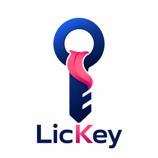
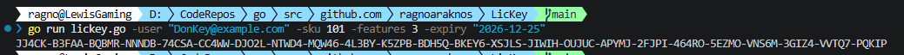
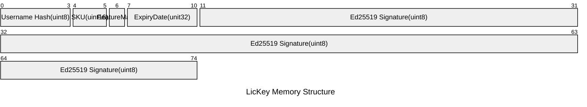

# LicKey

[](https://opensource.org/licenses/MIT)



A simple and secure offline-only license key generator utility

## Features

* Generates secure license keys using industry standard ED25519 elliptic curve cryptography.
* License keys are formatted in a clean human input-compatible string.
* License keys encode useful user, SKU, feature and expiry date information.
* Built in Go with zero external compile time or runtime dependencies.

## Getting Started

### Prerequisites

* Go `1.26` or higher

### Install

The fastest way to install the binary directly to your `$GOPATH/bin`

```bash
go install [github.com/ragnoaraknos/lickey@latest](https://github.com/ragnoaraknos/lickey@latest)
```

Alternatively, clone and build from source:

```bash
git clone [https://github.com/RAGNOARAKNOS/LicKey.git](https://github.com/RAGNOARAKNOS/LicKey.git)
cd LicKey
go build -o LicKey main.go
```

### Usage

```bash
    ./LicKey -user="DonKey@example.com" -sku 101 -features 3 -expiry "2026-12-25"
```



| Argument | Acceptable Range | Example |
| - | - | - |
| `user` | any string, 1 character minimum | `DonKey@example.com` |
| `sku` | 0 to 65535 | `101` |
| `features` | 0 to 255 | `3` |
| `expiry` | Any date between 1970 and 2105, in the `YYYY-MM-DD` format | `2026-12-25` |

### Configuration

This application expects the following environment variables.

| Environment Variable | Description | Default |
| - | - | - |
| `lickey_privatekey` | The private key used by the ED25519 algorithm in conjunction with the public key to encode the license. | N/A - If not set, the application will generate a new keypair, present it in the terminal, and exit. |

## Contributing

The author encourages anyone to contribute to this project with improvements and updates, provided you adhere to the LICENSE and follow standard open-source best practices.
Fork away!

## License

Distributed under the MIT License. See LICENSE for more information.

## Design Considerations

### Language Choice

Go was selected as the language of choice because the cryptographic libraries are included in the base language and therefore this industry standard implementation of ecliptic curve cryptography could be implemented with no dependencies other than the language itself.  
Go compiles into small binaries and is then not dependent on a runtime.
Go has no costs associated with it, as you may have with a commercial language like MATLAB.

C# was considered, but that would require a dependency on the BouncyCastle open source cryptography package.

Scripting languages were disregarded to avoid the risk that the scripts would be modified maliciously or accidentally when using this tool.

### Private Key Generation

If a private key is not correctly inserted into your operating system variables at runtime the application will automatically generate a new private key which must be stored securely on your machine and a public key that must be distributed to any client applications.

> It is the end users responsibility to make note of this and store it. The application does not do this for you.

### Structure of a License Key

A generated key is a 143 character long (see example structure below)

`NFSXG-IDOMV-AQAAM-S6AMB-UFAEA-6H75V-63Z3N-M6W44...`

The verification engine strips away the dashes and decodes the text back into a raw 75-byte array. In memory, that array is structured into two main zones:

* Zone 1: The Data Payload (Bytes 0 to 10): Contains the actual license parameters (Username fingerprint, SKU, features, expiration). It is completely readable by the client.
* Zone 2: The Cryptographic Signature (Bytes 11 to 74): A fixed 64-byte mathematical proof generated by your private key.

> The author recognises that this is quite a long key and its size is largely due to the use of the signature.
> The alternative is to generate a smaller key with a much simpler verification checksum approach, similar to what Microsoft use.  This approach is more robust and follows industry standard norms and is therefore simpler to implement at this time.

#### Internal Binary Byte Structure

Inside that 75-byte raw array, the data fields are laid out in a strict sequence using _Little-Endian_ byte order (meaning multi-byte numbers like the SKU and Timestamp are stored with their least significant bytes first).



| Byte Range | Field | DataType | Allocated Size | Notes |
| - | - | - | - | - |
| 0 - 3 | Username hash | `unint8[4]` | 4 Bytes | A _hash_ of the username, to reduce the output key size |
| 4 - 5 | SKU ID | `uint16` | 2 Bytes | Unique product number |
| 6 | Feature Mask | `uint8` | 1 Byte | We allocate exactly 1 byte for features to save space. This field acts as a bitmask where each individual bit toggles a feature on (1) or off (0) inside your application engine. <br>E.g 1 = Feature(A), 2 = Feature(B), 3 = Feature(A+B), etc. |
| 7 - 10 | Expiration Date | `uint32` | 4 Bytes | Stored as UNIX epoch time |
| 11 - 74 | Ed25519 Signature | `uint8[64]` | 64 Bytes | The anti-tamper signature |

#### Text Encoding Structure

If you look at the total binary size, it equals exactly 75 bytes (4+2+1+4+64).

To turn 75 bytes of raw, un-typeable binary data into plain text, we pass it through a Base32 Encoder (using the standard alphabet A-Z and numbers 2-7).

* The Math: Base32 packs exactly 5 bits of data into every 1 text character.
* A 75-byte array contains exactly 600 bits (75×8).
* Dividing those 600 bits into 5-bit chunks gives us, 5 bits per character / 600 bits => 120 text characters
* Finally, the code loops through those 120 characters and drops a dash (-) every 5 slots to prevent eye fatigue when users type it, resulting in a total printed string length of 143 characters (120 letters + 23 dashes).

## Client Examples

The following are simple examples of how to consume the license keys provided by LicKey and verify them in your client applications.

### Go

The Go client was developed in order to test LicKey.

### Unreal Engine Blueprint

> TBD

### C#/Unity

> TBD
