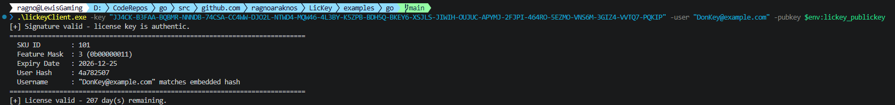

# LicKey Client (Go)

A small command-line tool that consumes a license key produced by the
[LicKey generator](../../lickey.go), verifies its Ed25519 signature, and prints
the embedded license details.

## Build

```sh
go build -o lickeyClient ./...
```

## Usage

```sh
lickeyClient -key <LICENSE-KEY> -pubkey <BASE64-PUBLIC-KEY> [-user <username>]
```



| Flag      | Required | Description                                                        |
| --------- | -------- | ------------------------------------------------------------------ |
| `-key`    | yes      | The hyphen-chunked license key to inspect.                         |
| `-pubkey` | yes      | The issuer's Base64-encoded Ed25519 public key.                    |
| `-user`   | no       | A username to check against the 4-byte hash embedded in the key.   |

## Example

```sh
lickeyClient \
  -key FPMAN-SJKAA-CYB3B-WNODE-I45EI-NNJUP-... \
  -pubkey LbpQTLoslOmIE8d0miQRBJi97bnpLO7Uu3FGpdMuKrA= \
  -user alice
```

```
[+] Signature valid - license key is authentic.
=============================================================================
  SKU ID        : 42
  Feature Mask  : 5 (0b00000101)
  Expiry Date   : 2027-01-01
  User Hash     : 2bd806c9
  Username      : "alice" matches embedded hash
=============================================================================
[+] License valid - 214 day(s) remaining.
```

## What it checks

1. **Signature** — the core tamper check. The key's 11-byte payload (SKU,
   feature mask, expiry and a 4-byte username hash) is verified against the
   issuer's public key. Any modification to those fields invalidates the
   signature.
2. **Username** — the key stores only a 4-byte SHA-256 hash of the username, so
   the name itself cannot be recovered. Supplying `-user` re-hashes a candidate
   name and reports whether it matches.
3. **Expiry** — the embedded expiry date is compared against the current date.

## Exit codes

| Code | Meaning                                  |
| ---- | ---------------------------------------- |
| `0`  | License valid and not expired.           |
| `1`  | Bad arguments, public key, or key format.|
| `2`  | Signature invalid (tampered / wrong key).|
| `3`  | Signature valid but license has expired. |
